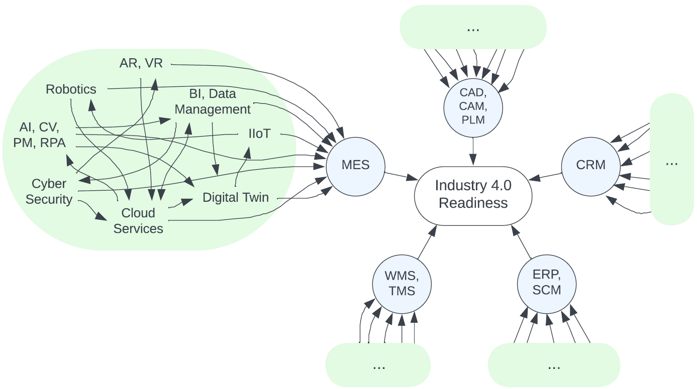

# FCM-based Maturity Model for Smart Manufacturing 

Implementation of a FCM-based Maturity Model for Smart Manufacturing focusing on IT systems and key enabling technologies as drivers. The map assesses (running the FCM) the level of smart manufacturing of a company to capture the current state of digitization (As Is) and to suggest (via Genetic Algorithm) paths for digital growth (To Be).



## Structure of the repository
```
.
├── evaluation                      # sources for the evaluation
|   ├── eval_structure.py           # evaluation of the structure
|   ├── eval_fcm.py                 # evaluation of the FCM inference
|   ├── notebook_eval_fcm.ipynb     # evaluation results of the FCM inference
|   ├── eval_ga.py                  # evaluation of the GA algorithm
|   ├── notebook_eval_ga.ipynb      # evaluation results of the GA algorithm
|   └── ...
├── model                           # sources of the FCM model
|   └── ...
├── cases                           # sources of the cases to be evaluated
|   └──...
├── utils
|   ├── data                        # raw data to construct the model
|   |   └──...
|   └── single_FCM.py               # script to find the lambda of each FCM
├── config.json                     # configuration file
├── FCM_class.py                    # FCM class implementing inference
├── GA_class.py                     # GA class implementing the genetic algorithm
├── FLT_class.py                    # FLT class implementing the membership functions
└── ...
```


## Getting Started

- Install [Miniconda](https://docs.anaconda.com/free/miniconda/) or [Anaconda](https://www.anaconda.com/download) if you haven't already.

- Create a new conda environment:
    ```shell
    conda create -n pyfcm python=3.10
    conda activate pyfcm
    ```

- Install the dependencies:
    ```shell
    pip install -r requirements.py
    ```

## Run the code

- Activate the conda environment:
    ```shell
    conda activate pyfcm
    ```

- Define the activation levels (AL) of each technology (node) inside the [cases](cases) folder - [follow below instructions](#define-al-for-a-new-case). Or use one of the cases already available `[low, medium, high, mix]`.

- Modify [config.json](config.json) as you wish. As an example:
    ```json
    {
        "case": "low",
        "target_val": "VH",
        "to_remove": []
    }
    ```
    `case` key refers to the company case to study (one of the folder in [cases](cases)), `target_val` refers to the target value to reach in the genetic algorithm (accepted values are `[VL, L, M, H, VH] = [very low, low, medium, high, very high]`) and `to_remove` refers to the set of IT systems to remove from the map (accepted values are `['CAD, CAM, PLM', 'CRM', 'ERP, SCM', 'WMS, TMS', 'MES']`).

- To run the FCM (inference analysis):
    ```shell
    python FCM_class.py
    ```

- To run what-if analysis (genetic algorithm):
    ```shell
    python GA_class.py
    ```

### Define AL for a new case

- Create a new folder in [cases](cases).
- Create five files `X_al.csv` for `X=[1,5]={1 = "CAD,CAM,PLM", 2="CRM", 3="ERP,SCM", 4="WMS,TMS", 5="MES"}` to define the AL of each technology of each IT system. Linguistic terms used are `[NA, VL, L, M, H, VH] = [neutral, very low, low, medium, high, very high]`. The concept linked to the main FCM, the one in $(row=0,column=0)$ must have `NA` value. Below an example:
    ```csv
    NA,0
    L,0
    M,0
    H,0
    L,0
    L,0
    M,0
    ```
    To check the technologies linked to each node, have a look at the `.json` files in [model](model).
- Put the files in the folder you created.

## How to run the experiments

#### Graph theory analyses
In order to show results of the graph theory analyses:
```shell
cd evaluation
python eval_structure.py
```

#### FCM inference analysis
In order to run and plot results of the FCM inference analyses:
```shell
cd evaluation
python eval_fcm.py
```
**N.B.** Results are also reported in this [notebook](evaluation/notebook_eval_fcm.ipynb).

#### GA analysis
In order to run and plot results of the GA analysis:
```shell
cd evaluation
python eval_ga.py
```
**N.B.** This [pickle](evaluation/ga_results/results.pkl) file stores results shown in the article and this [notebook](evaluation/notebook_eval_ga.ipynb) reports the outcome.

## License
Distributed under the MIT License. See [LICENSE](LICENSE) for more information.